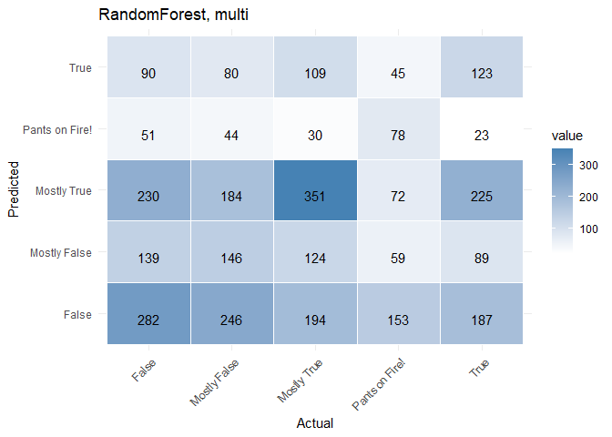
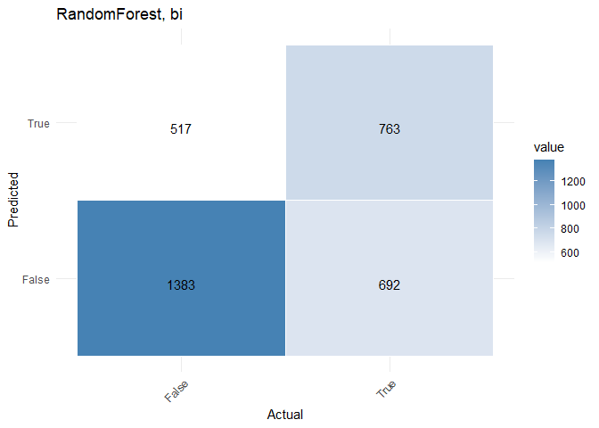
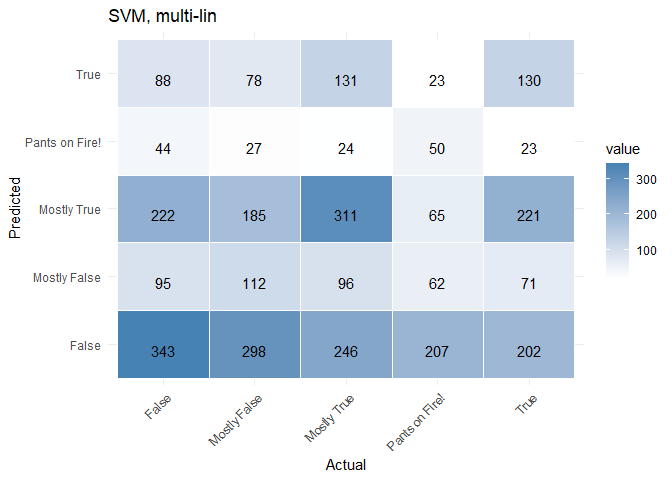
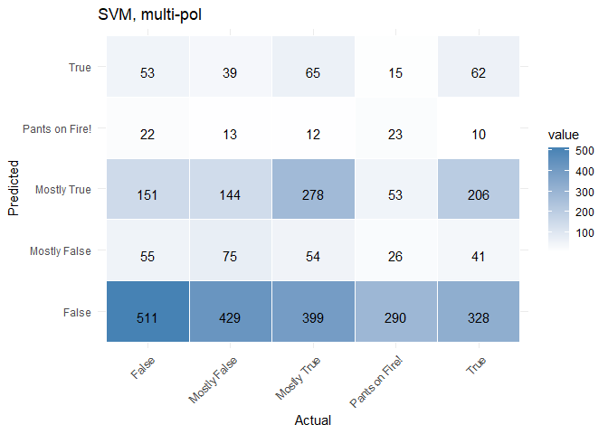
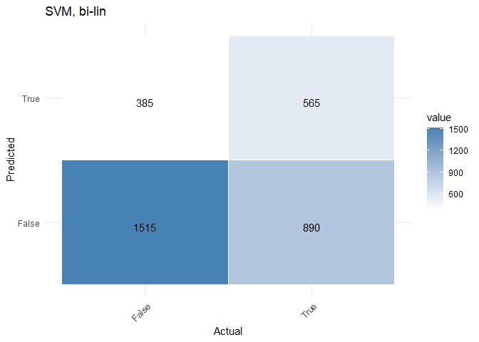

Отчет по предмету Программные инструменты обработки данных
================
Хайдарова Алиса
2024-12-11

## Введение

Рассматривается задача классификации текста. Факторы классификации -
правда/ложь.

- Предобработка текста
- Обучение классификаторов (Random Forest и SVM)
- Вывод результатов классификации для тестовой выборки

## Код программы на языке R

``` r
library(dplyr)         # Работа с данными
library(textstem)      # Лемматизация
library(stringr)       # Строки
library(tm)            # Векторизация
library(caret)         # Создание моделей машинного обучения
library(e1071)         # Метод опорных векторов 
library(randomForest)  # RandomForest
library(ggplot2)
library(reshape2)
```

### Подгружаем таблицы CSV

``` r
fact_clean <- read.csv("files/politifact_clean.csv")
fact_clean_bi <- read.csv("files/politifact_clean_binarized.csv")

data <- fact_clean
data <- select(data, -link)
```

### Предобработка текста и классов

#### нормирование текста

``` r
clean_text_function <- function(text) {
  text %>%
    tolower() %>%                           # Приведение к нижнему регистру
    str_replace_all("[[:punct:]]", "") %>%  # Удаление пунктуации
    str_squish() %>%                        # Удаление лишних пробелов
    lemmatize_strings()                     # Лемматизация
}
data <- data %>%
  mutate(clean_text = clean_text_function(statement))
```

#### кодирование значений

``` r
data$class <- as.factor(data$veracity)
data$class_bi <- as.factor(ifelse(fact_clean_bi$veracity == 1, "True", "False"))
```

#### векторизация

``` r
corpus <- Corpus(VectorSource(data$clean_text))
dtm <- DocumentTermMatrix(corpus)
dtm <- removeSparseTerms(dtm, 0.99)
dtm_matrix <- as.data.frame(as.matrix(dtm))
dtm_matrix$class <- data$class
dtm_matrix$class_bi <- data$class_bi
```

### Подготовка к обучению

#### данные для многоклассовой классификации

``` r
set.seed(123)

train_index <- createDataPartition(dtm_matrix$class, p = 0.7, list = FALSE)
train_data <- dtm_matrix[train_index, ]
test_data <- dtm_matrix[-train_index, ]
```

#### данные для бинарной классификации

``` r
set.seed(123)

train_index <- createDataPartition(dtm_matrix$class_bi, p = 0.7, list = FALSE)
train_data_bi <- dtm_matrix[train_index, ]
test_data_bi <- dtm_matrix[-train_index, ]
```

### RandomForest

#### многоклассовая

``` r
rf_model <- randomForest(x = select(train_data, -class, -class_bi),
                         y = train_data$class,
                         ntree = 100)
predictions_rf <- predict(rf_model,
                          newdata = select(test_data, -class, -class_bi))
conf_matrix_rf_multi <- confusionMatrix(predictions_rf,
                                        test_data$class)
```

    ## Confusion Matrix and Statistics
    ## 
    ##                 Reference
    ## Prediction       False Mostly False Mostly True Pants on Fire! True
    ##   False            282          246         194            153  187
    ##   Mostly False     139          146         124             59   89
    ##   Mostly True      230          184         351             72  225
    ##   Pants on Fire!    51           44          30             78   23
    ##   True              90           80         109             45  123
    ## 
    ## Overall Statistics
    ##                                           
    ##                Accuracy : 0.2922          
    ##                  95% CI : (0.2768, 0.3079)
    ##     No Information Rate : 0.2409          
    ##     P-Value [Acc > NIR] : 6.117e-12       
    ##                                           
    ##                   Kappa : 0.093           
    ##                                           
    ##  Mcnemar's Test P-Value : < 2.2e-16       
    ## 
    ## Statistics by Class:
    ## 
    ##                      Class: False Class: Mostly False Class: Mostly True
    ## Sensitivity               0.35606             0.20857             0.4344
    ## Specificity               0.69555             0.84514             0.7207
    ## Pos Pred Value            0.26554             0.26212             0.3305
    ## Neg Pred Value            0.77749             0.80193             0.8006
    ## Prevalence                0.23614             0.20871             0.2409
    ## Detection Rate            0.08408             0.04353             0.1047
    ## Detection Prevalence      0.31664             0.16607             0.3166
    ## Balanced Accuracy         0.52581             0.52686             0.5776
    ##                      Class: Pants on Fire! Class: True
    ## Sensitivity                        0.19165     0.19011
    ## Specificity                        0.94978     0.88031
    ## Pos Pred Value                     0.34513     0.27517
    ## Neg Pred Value                     0.89482     0.81975
    ## Prevalence                         0.12135     0.19290
    ## Detection Rate                     0.02326     0.03667
    ## Detection Prevalence               0.06738     0.13327
    ## Balanced Accuracy                  0.57071     0.53521

    ## Using Prediction, Reference as id variables

<!-- -->

#### бинарная

``` r
rf_model <- randomForest(x = select(train_data_bi, -class, -class_bi),
                         y = train_data_bi$class_bi,
                         ntree = 100)
predictions_rf <- predict(rf_model,
                          newdata = select(test_data_bi, -class, -class_bi))
conf_matrix_rf_bi <- confusionMatrix(predictions_rf,
                                     test_data_bi$class_bi)
```

    ## Confusion Matrix and Statistics
    ## 
    ##           Reference
    ## Prediction False True
    ##      False  1383  692
    ##      True    517  763
    ##                                           
    ##                Accuracy : 0.6396          
    ##                  95% CI : (0.6231, 0.6559)
    ##     No Information Rate : 0.5663          
    ##     P-Value [Acc > NIR] : < 2.2e-16       
    ##                                           
    ##                   Kappa : 0.2559          
    ##                                           
    ##  Mcnemar's Test P-Value : 5.609e-07       
    ##                                           
    ##             Sensitivity : 0.7279          
    ##             Specificity : 0.5244          
    ##          Pos Pred Value : 0.6665          
    ##          Neg Pred Value : 0.5961          
    ##              Prevalence : 0.5663          
    ##          Detection Rate : 0.4122          
    ##    Detection Prevalence : 0.6185          
    ##       Balanced Accuracy : 0.6261          
    ##                                           
    ##        'Positive' Class : False           
    ## 

    ## Using Prediction, Reference as id variables

<!-- -->

### Метод опорных векторов

#### многоклассовая

``` r
svm_model <- svm(x = select(train_data, -class, -class_bi),
                 y = train_data$class,
                 kernel = "linear")
predictions_svm <- predict(svm_model, newdata = select(test_data, -class, -class_bi))
conf_matrix_svm_multi <- confusionMatrix(predictions_svm, test_data$class)
```

    ## Confusion Matrix and Statistics
    ## 
    ##                 Reference
    ## Prediction       False Mostly False Mostly True Pants on Fire! True
    ##   False            343          298         246            207  202
    ##   Mostly False      95          112          96             62   71
    ##   Mostly True      222          185         311             65  221
    ##   Pants on Fire!    44           27          24             50   23
    ##   True              88           78         131             23  130
    ## 
    ## Overall Statistics
    ##                                           
    ##                Accuracy : 0.2821          
    ##                  95% CI : (0.2669, 0.2976)
    ##     No Information Rate : 0.2409          
    ##     P-Value [Acc > NIR] : 2.428e-08       
    ##                                           
    ##                   Kappa : 0.0767          
    ##                                           
    ##  Mcnemar's Test P-Value : < 2.2e-16       
    ## 
    ## Statistics by Class:
    ## 
    ##                      Class: False Class: Mostly False Class: Mostly True
    ## Sensitivity                0.4331             0.16000            0.38490
    ## Specificity                0.6280             0.87792            0.72781
    ## Pos Pred Value             0.2647             0.25688            0.30976
    ## Neg Pred Value             0.7818             0.79849            0.78851
    ## Prevalence                 0.2361             0.20871            0.24091
    ## Detection Rate             0.1023             0.03339            0.09273
    ## Detection Prevalence       0.3864             0.12999            0.29934
    ## Balanced Accuracy          0.5306             0.51896            0.55635
    ##                      Class: Pants on Fire! Class: True
    ## Sensitivity                        0.12285     0.20093
    ## Specificity                        0.95996     0.88179
    ## Pos Pred Value                     0.29762     0.28889
    ## Neg Pred Value                     0.88795     0.82197
    ## Prevalence                         0.12135     0.19290
    ## Detection Rate                     0.01491     0.03876
    ## Detection Prevalence               0.05009     0.13417
    ## Balanced Accuracy                  0.54140     0.54136

    ## Using Prediction, Reference as id variables

<!-- -->

``` r
svm_model <- svm(x = select(train_data, -class, -class_bi),
                 y = train_data$class,
                 kernel = "polynomial",
                 degree = 2)
predictions_svm <- predict(svm_model, newdata = select(test_data, -class, -class_bi))
conf_matrix_svm_multi_pol <- confusionMatrix(predictions_svm, test_data$class)
```

    ## Confusion Matrix and Statistics
    ## 
    ##                 Reference
    ## Prediction       False Mostly False Mostly True Pants on Fire! True
    ##   False            511          429         399            290  328
    ##   Mostly False      55           75          54             26   41
    ##   Mostly True      151          144         278             53  206
    ##   Pants on Fire!    22           13          12             23   10
    ##   True              53           39          65             15   62
    ## 
    ## Overall Statistics
    ##                                           
    ##                Accuracy : 0.2829          
    ##                  95% CI : (0.2677, 0.2985)
    ##     No Information Rate : 0.2409          
    ##     P-Value [Acc > NIR] : 1.249e-08       
    ##                                           
    ##                   Kappa : 0.0693          
    ##                                           
    ##  Mcnemar's Test P-Value : < 2.2e-16       
    ## 
    ## Statistics by Class:
    ## 
    ##                      Class: False Class: Mostly False Class: Mostly True
    ## Sensitivity                0.6452             0.10714            0.34406
    ## Specificity                0.4356             0.93369            0.78240
    ## Pos Pred Value             0.2611             0.29880            0.33413
    ## Neg Pred Value             0.7989             0.79858            0.78985
    ## Prevalence                 0.2361             0.20871            0.24091
    ## Detection Rate             0.1524             0.02236            0.08289
    ## Detection Prevalence       0.5835             0.07484            0.24806
    ## Balanced Accuracy          0.5404             0.52041            0.56323
    ##                      Class: Pants on Fire! Class: True
    ## Sensitivity                       0.056511     0.09583
    ## Specificity                       0.980658     0.93646
    ## Pos Pred Value                    0.287500     0.26496
    ## Neg Pred Value                    0.882712     0.81250
    ## Prevalence                        0.121348     0.19290
    ## Detection Rate                    0.006857     0.01849
    ## Detection Prevalence              0.023852     0.06977
    ## Balanced Accuracy                 0.518585     0.51614

    ## Using Prediction, Reference as id variables

<!-- -->

#### бинарная

``` r
svm_model <- svm(x = select(train_data_bi, -class, -class_bi),
                 y = train_data_bi$class_bi,
                 kernel = "linear")
predictions_svm <- predict(svm_model, newdata = select(test_data_bi, -class, -class_bi))
conf_matrix_svm_bi <- confusionMatrix(predictions_svm, test_data_bi$class_bi)
```

    ## Confusion Matrix and Statistics
    ## 
    ##           Reference
    ## Prediction False True
    ##      False  1515  890
    ##      True    385  565
    ##                                           
    ##                Accuracy : 0.62            
    ##                  95% CI : (0.6033, 0.6364)
    ##     No Information Rate : 0.5663          
    ##     P-Value [Acc > NIR] : 1.597e-10       
    ##                                           
    ##                   Kappa : 0.1936          
    ##                                           
    ##  Mcnemar's Test P-Value : < 2.2e-16       
    ##                                           
    ##             Sensitivity : 0.7974          
    ##             Specificity : 0.3883          
    ##          Pos Pred Value : 0.6299          
    ##          Neg Pred Value : 0.5947          
    ##              Prevalence : 0.5663          
    ##          Detection Rate : 0.4516          
    ##    Detection Prevalence : 0.7168          
    ##       Balanced Accuracy : 0.5928          
    ##                                           
    ##        'Positive' Class : False           
    ## 

    ## Using Prediction, Reference as id variables

<!-- -->
